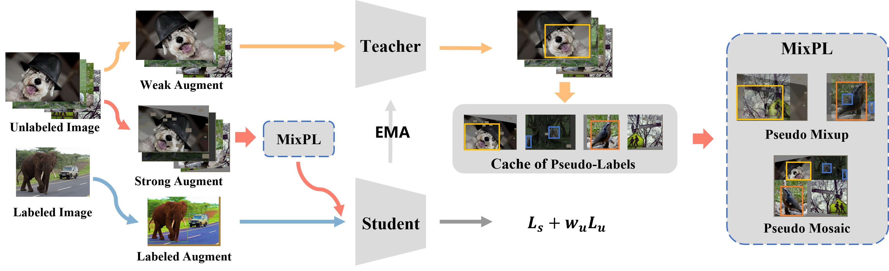
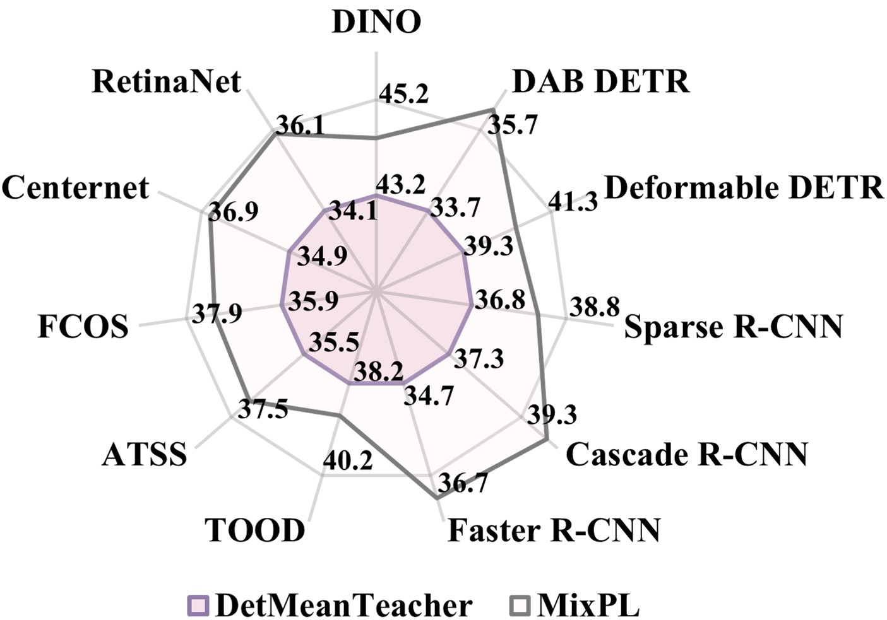

# Mixed Pseudo Labels for Semi-Supervised Object Detection

This repo is the official implementation of "Mixed Pseudo Labels for Semi-Supervised Object Detection" by Zeming Chen, Wenwei Zhang, Xinjiang Wang, Kai Chen and Zhi Wang.

## Introduction

While the pseudo-label method has demonstrated considerable success in semi-supervised object detection tasks, this paper uncovers notable limitations within this approach. 
Specifically, the pseudo-label method tends to amplify the inherent strengths of the detector while accentuating its weaknesses, which is manifested in the missed detection of pseudo-labels, particularly for small and tail category objects.
To overcome these challenges, this paper proposes Mixed Pseudo Labels (MixPL), consisting of Mixup and Mosaic for pseudo-labeled data, to mitigate the negative impact of missed detections and balance the model's learning across different object scales. 
Additionally, the model's detection performance on tail categories is improved by resampling labeled data with relevant instances. 
Notably, MixPL consistently improves the performance of various detectors and obtains new state-of-the-art results with Faster R-CNN, FCOS, and DINO on COCO-Standard and COCO-Full benchmarks. 
Furthermore, MixPL also exhibits good scalability on large models, improving DINO Swin-L by 2.5 AP and achieving nontrivial new records (60.2 AP) on the COCO val2017 benchmark without extra annotations.

## License

This project is released under the MIT license. Please see the [LICENSE](LICENSE) file for more information.
